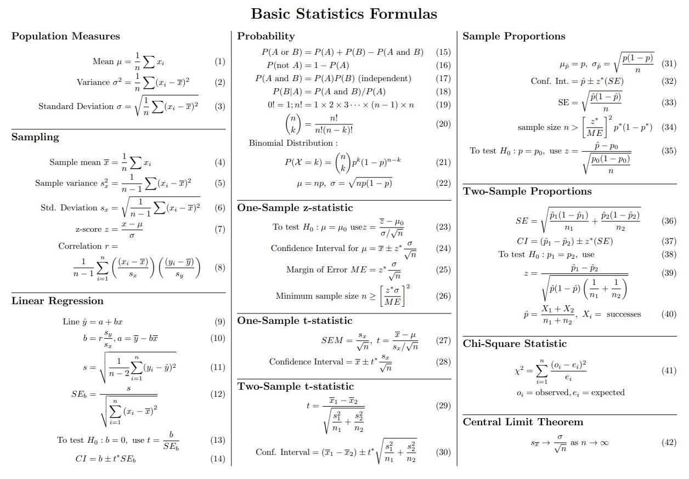

# Introduction to Statistics

- [Introduction to Statistics](#introduction-to-statistics)
  - [1. Data Types and Variables](#1-data-types-and-variables)
    - [Data Classification](#data-classification)
    - [Variable Categories](#variable-categories)
  - [2. Descriptive Statistics](#2-descriptive-statistics)
    - [Measures of Dispersion](#measures-of-dispersion)
      - [Variance](#variance)
      - [Standard Deviation](#standard-deviation)
    - [Measures of Position (Quantiles)](#measures-of-position-quantiles)
      - [Quartiles](#quartiles)
  - [3. Probability Functions](#3-probability-functions)
    - [Probability Mass Functions (PMFs)](#probability-mass-functions-pmfs)
      - [Bernoulli distribution](#bernoulli-distribution)
      - [Binomial distribution](#binomial-distribution)
      - [Poisson distribution](#poisson-distribution)
      - [Geometric distribution](#geometric-distribution)
      - [Hypergeometric distribution](#hypergeometric-distribution)
      - [Negative Binomial distribution](#negative-binomial-distribution)
      - [Summary Table](#summary-table)
    - [Probability Density Functions (PDFs)](#probability-density-functions-pdfs)
      - [Uniform distribution](#uniform-distribution)
      - [Normal (Gaussian) distribution](#normal-gaussian-distribution)
      - [Exponential distribution](#exponential-distribution)
      - [Gamma distribution](#gamma-distribution)
      - [Beta distribution](#beta-distribution)
      - [Chi-square distribution](#chi-square-distribution)
      - [Student's $t$ distribution](#students-t-distribution)
      - [Lognormal distribution](#lognormal-distribution)
      - [Weibull distribution](#weibull-distribution)
      - [Laplace distribution](#laplace-distribution)
      - [Summary Table](#summary-table-1)
  - [ Cheatsheet](#-cheatsheet)

---

## 1. Data Types and Variables

### Data Classification
* **Qualitative:** Categorical properties (e.g., eye color, fruit type).
* **Quantitative:** Properties that can be counted or measured (e.g., age, blood pressure).

### Variable Categories
* **Nominal Qualitative:** Values segregate the population into mutually exclusive, unordered categories (e.g., marital status).
* **Ordinal Qualitative:** Values possess a natural, meaningful ordering (e.g., patient condition: good, mild, severe).
* **Discrete Quantitative:** Variables that take distinct, countable values within a real interval (e.g., number of cars owned).
* **Continuous Quantitative:** Variables that can take any real value within an interval (e.g., weight, height).

---

## 2. Descriptive Statistics

### Measures of Dispersion

#### Variance

* **Population Variance:** Used when analyzing the complete population ($N$).
$$\text{var}(x) = \sigma^2 = \frac{1}{N} \sum_{i=1}^{N} (x_i - \mu)^2$$
where $\mu$ is the population mean.

* **Sample Variance:** Uses Bessel's correction ($N-1$) to provide an unbiased estimator from a sample.
$$\text{var}(x) = s^2 = \frac{1}{N-1} \sum_{i=1}^{N} (x_i - \bar{x})^2$$
where $\bar{x}$ is the sample mean.

#### Standard Deviation
$$\sigma = \sqrt{\text{var}(x)}$$

### Measures of Position (Quantiles)
A **percentile** is the value below which a given percentage of observations falls (e.g., the 80th percentile is the threshold holding 80% of the data below it).

#### Quartiles
Specific percentiles dividing the dataset into four equal parts:
* **$Q_1$ (First quartile):** 25th percentile.
* **$Q_2$ (Second quartile):** 50th percentile, identical to the **median**.
* **$Q_3$ (Third quartile):** 75th percentile.

---
## 3. Probability Functions

### Probability Mass Functions (PMFs) 

Functions that give the probability $P$ that a descrete random variable $X$ is exactly equal to some value (generally $x$ or $k$).

#### Bernoulli distribution

Models a single trial with binary outcomes: success ($x=1$) with probability $p$, or failure ($x=0$) with probability $1-p$.

$$
P(X=x)=p^x(1-p)^{1-x}, \qquad x\in\{0,1\} \equiv \{\rm failure, success\}
$$

#### Binomial distribution

Models the total number of successes $k$ in $n$ independent Bernoulli trials with a constant success probability $p$.

$$P(X=k) = \binom{n}{k} p^k (1-p)^{n-k}, \qquad k \in \{0, 1, \dots, n\}$$

#### Poisson distribution

Models the probability of $k$ events ocurring in a fixed interval when:
- events occur **independently**,
- events occur at a **constant average rate** $\lambda$,
- and the probability of **two or more events occurring simultaneously is negligible**.

$$P(X=k) = \frac{\lambda^k e^{-\lambda}}{k!}, \qquad k \in \{0, 1, 2, \dots\}$$

#### Geometric distribution

Models the number of trials $k$ required to achieve the first success in a sequence of independent Bernoulli trials.

$$P(X=k) = (1-p)^{k-1}p, \qquad k \in \{1, 2, \dots\}$$

#### Hypergeometric distribution 

Models the number of successes $k$ in a sample size $n$ drawn **without replacement** from a finite population $N$ containing $K$ total successes.
$$P(X=k) = \frac{\binom{K}{k}\binom{N-K}{n-k}}{\binom{N}{n}}$$

#### Negative Binomial distribution

Models the number of trials $k$ needed for exactly $r$ successes to ocurr in **independent** Bernoulli trials.

$$P(X=k) = \binom{k-1}{r-1} p^r (1-p)^{k-r}, \qquad k \in \{r, r+1, \dots\}$$

#### Summary Table

| Distribution | What does $X$ measure? | Key Context / Condition | Probability Mass Function $P(X=k)$ | Support ($k$) |
| --- | --- | --- | --- | --- |
| **Bernoulli** | Outcome of 1 single trial. | Success ($1$) with prob. $p$, Failure ($0$) with $1-p$. | $p^k(1-p)^{1-k}$ | $k \in \{0, 1\}$ |
| **Binomial** | Total number of successes in $n$ trials. | Independent trials **with replacement**; constant $p$. | $\binom{n}{k} p^k (1-p)^{n-k}$ | $k \in \{0, \dots, n\}$ |
| **Poisson** | Number of events in a fixed interval. | Constant average rate $\lambda$; independent events. | $\frac{\lambda^k e^{-\lambda}}{k!}$ | $k \in \{0, 1, 2, \dots\}$ |
| **Geometric** | Number of trials up to the **first** success. | Independent trials; stops exactly when success occurs. | $(1-p)^{k-1}p$ | $k \in \{1, 2, \dots\}$ |
| **Hypergeometric** | Number of successes in a sample size $n$. | Population $N$ with $K$ successes; sampled **without replacement**. | $\frac{\binom{K}{k}\binom{N-K}{n-k}}{\binom{N}{n}}$ | $\max(0, n-N+K) \le k \le \min(n, K)$ |
| **Negative Binomial** | Number of trials needed for **exactly $r$** successes. | Generalization of Geometric; stops when target $r$ is met. | $\binom{k-1}{r-1} p^r (1-p)^{k-r}$ | $k \in \{r, r+1, \dots\}$ |

### Probability Density Functions (PDFs)

Functions that describe the probability distribution of a **continuous** random variable $X$. Since $X$ is continuous,

$$
P(X=x)=0,
$$

and probabilities are obtained by integrating the density over an interval:

$$
P(a\le X\le b)=\int_a^b f(x)\,dx.
$$

#### Uniform distribution

Models a continuous random variable that is **equally likely** to take any value within an interval $[a,b]$.

$$
f(x)=
\begin{cases}
\dfrac{1}{b-a}, & a\le x\le b,\\
0, & \text{otherwise.}
\end{cases}
$$

#### Normal (Gaussian) distribution

Models continuous data that clusters symmetrically around a mean $\mu$ with spread determined by the standard deviation $\sigma$.

$$
f(x)=\frac{1}{\sigma\sqrt{2\pi}}
e^{-\frac{(x-\mu)^2}{2\sigma^2}},
\qquad x\in\mathbb{R}
$$

#### Exponential distribution

Models the **waiting time until the first event** in a Poisson process, where events occur independently at a constant average rate $\lambda$.

$$
f(x)=
\lambda e^{-\lambda x},
\qquad x\ge0
$$

#### Gamma distribution

Models the waiting time until the **$k$-th event** in a Poisson process.

$$
f(x)=
\frac{\lambda^k x^{k-1}e^{-\lambda x}}
{\Gamma(k)},
\qquad x\ge0
$$

where $\Gamma(k)$ is the Gamma function.

#### Beta distribution

Models random variables bounded between 0 and 1, making it useful for probabilities and proportions.

$$
f(x)=
\frac{x^{\alpha-1}(1-x)^{\beta-1}}
{B(\alpha,\beta)},
\qquad 0\le x\le1
$$

where $B(\alpha,\beta)$ is the Beta function.

#### Chi-square distribution

Models the sum of squares of $\nu$ independent standard normal random variables. It is widely used in hypothesis testing and confidence intervals.

$$
f(x)=
\frac{1}{2^{\nu/2}\Gamma(\nu/2)}
x^{\nu/2-1}e^{-x/2},
\qquad x\ge0
$$

#### Student's $t$ distribution

Models the standardized sample mean when the population variance is unknown. It is commonly used for inference with small sample sizes.

$$
f(x)=
\frac{\Gamma\!\left(\frac{\nu+1}{2}\right)}
{\sqrt{\nu\pi}\,\Gamma\!\left(\frac{\nu}{2}\right)}
\left(1+\frac{x^2}{\nu}\right)^{-\frac{\nu+1}{2}},
\qquad x\in\mathbb{R}
$$

#### Lognormal distribution

Models a positive random variable whose logarithm follows a normal distribution. It is commonly used for incomes, biological measurements, and multiplicative growth processes.

$$
f(x)=
\frac{1}{x\sigma\sqrt{2\pi}}
e^{-\frac{(\ln x-\mu)^2}{2\sigma^2}},
\qquad x>0
$$

#### Weibull distribution

Models the lifetime of components and systems. It is widely used in reliability engineering and survival analysis because it can represent increasing, decreasing, or constant failure rates.

$$
f(x)=
\frac{k}{\lambda}
\left(\frac{x}{\lambda}\right)^{k-1}
e^{-(x/\lambda)^k},
\qquad x\ge0
$$

where $k>0$ is the shape parameter and $\lambda>0$ is the scale parameter.

#### Laplace distribution

Models continuous data with a sharper peak and heavier tails than the normal distribution. It is commonly used in robust statistics and machine learning.

$$
f(x)=
\frac{1}{2b}
e^{-\frac{|x-\mu|}{b}},
\qquad x\in\mathbb{R}
$$

where $\mu$ is the location parameter and $b>0$ is the scale parameter.

#### Summary Table

| Distribution | What does $X$ measure? | Key Context / Condition | Probability Density Function $f(x)$ | Support |
| --- | --- | --- | --- | --- |
| **Uniform** | Any value in an interval. | All values are equally likely. | $\frac{1}{b-a}$ | $a\le x\le b$ |
| **Normal (Gaussian)** | Continuous measurements around a mean. | Symmetric bell-shaped distribution. | $\frac{1}{\sigma\sqrt{2\pi}}e^{-\frac{(x-\mu)^2}{2\sigma^2}}$ | $x\in\mathbb{R}$ |
| **Exponential** | Waiting time until the first event. | Poisson process; constant rate $\lambda$. | $\lambda e^{-\lambda x}$ | $x\ge0$ |
| **Gamma** | Waiting time until the $k$-th event. | Generalization of the Exponential distribution. | $\frac{\lambda^k x^{k-1}e^{-\lambda x}}{\Gamma(k)}$ | $x\ge0$ |
| **Beta** | Probability or proportion. | Values constrained between 0 and 1. | $\frac{x^{\alpha-1}(1-x)^{\beta-1}}{B(\alpha,\beta)}$ | $0\le x\le1$ |
| **Chi-square** | Sum of squared standard normal variables. | Hypothesis testing and variance estimation. | $\frac{1}{2^{\nu/2}\Gamma(\nu/2)}x^{\nu/2-1}e^{-x/2}$ | $x\ge0$ |
| **Student's $t$** | Standardized sample mean. | Unknown population variance; small samples. | $\frac{\Gamma((\nu+1)/2)}{\sqrt{\nu\pi}\Gamma(\nu/2)}\left(1+\frac{x^2}{\nu}\right)^{-(\nu+1)/2}$ | $x\in\mathbb{R}$ |
| **Lognormal** | Positive continuous variable.        | $\ln(X)$ is normally distributed.         | $\frac{1}{x\sigma\sqrt{2\pi}}e^{-\frac{(\ln x-\mu)^2}{2\sigma^2}}$        | $x>0$   |        |                  |
| **Weibull**   | Lifetime or time-to-failure.         | Reliability and survival analysis.        | $\frac{k}{\lambda}\left(\frac{x}{\lambda}\right)^{k-1}e^{-(x/\lambda)^k}$ | $x\ge0$ |        |                  |
| **Laplace**   | Continuous variable around a center. | Similar to Normal but with heavier tails. | $\frac{1}{2b}e^{-\frac{\| x-\mu \| }{b}}$ | $x\in\mathbb{R}$ |

---
## 
 Cheatsheet

